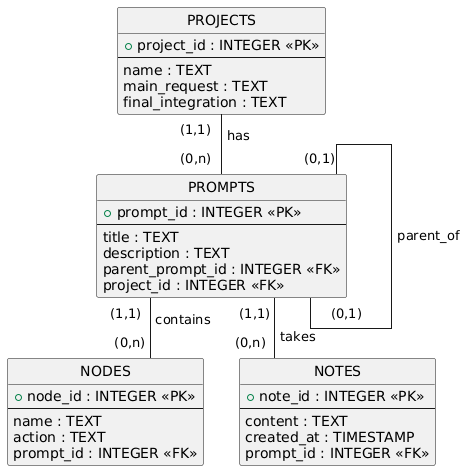

## Backend Server
### Persistence Layer
- Technology chosen: SQLite
- Command to initialize and seed the Database: `python3 init_db.py`

#### ER Diagram


#### DDL queries

Table: PROJECTS
```
 CREATE TABLE IF NOT EXISTS PROJECTS (
    project_id INTEGER PRIMARY KEY AUTOINCREMENT,
    name TEXT NOT NULL,
    main_request TEXT,
    final_integration TEXT
 )
```

Table: PROMPTS
```
CREATE TABLE IF NOT EXISTS PROMPTS (
    prompt_id INTEGER PRIMARY KEY AUTOINCREMENT,
    title TEXT NOT NULL,
    description TEXT,
    parent_prompt_id INTEGER,
    project_id INTEGER,
    FOREIGN KEY (parent_prompt_id) REFERENCES PROMPTS(prompt_id) ON DELETE SET NULL,
    FOREIGN KEY (project_id) REFERENCES PROJECTS(project_id) ON DELETE CASCADE
)
```

Table: NODES
```
CREATE TABLE IF NOT EXISTS NODES (
    node_id INTEGER PRIMARY KEY AUTOINCREMENT,
    prompt_id INTEGER NOT NULL,
    name TEXT NOT NULL,
    action TEXT,
    FOREIGN KEY (prompt_id) REFERENCES PROMPTS(prompt_id) ON DELETE CASCADE
)
```

Table: NOTES
```
CREATE TABLE IF NOT EXISTS NOTES (
    note_id INTEGER PRIMARY KEY AUTOINCREMENT,
    prompt_id INTEGER NOT NULL,
    content TEXT NOT NULL,
    created_at TIMESTAMP DEFAULT CURRENT_TIMESTAMP,
    FOREIGN KEY (prompt_id) REFERENCES PROMPTS(prompt_id) ON DELETE CASCADE
)
```